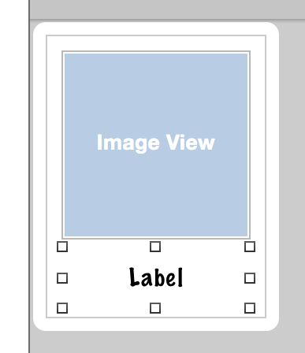
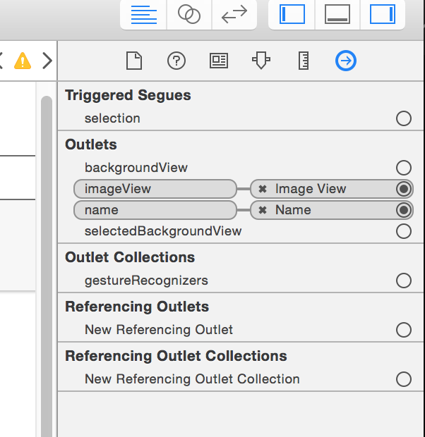

# Designing UICollectionView cells

We’ve used `UITableViewController` a few times so far, but this time we’re going to use `UICollectionViewController` instead. The procedure is quite similar, and starts by opening ViewController.swift and making it inherit from `UICollectionViewController` instead.

So, find this line:

    class ViewController: UIViewController {

And change it to this:

    class ViewController: UICollectionViewController {

Now open Main.storyboard in Interface Builder and delete the existing view controller. In its place, drag out a Collection View Controller (*not* a regular collection view!), then mark it as the initial view controller and embed it inside a navigation controller. Make sure you also use the identity inspector to change its class to “ViewController” so that it points to our class in code.

Use the document outline to select the collection view inside the collection view controller, then go to the size inspector and set Cell Size to have the width 140 and height 180. Now set the section insets for top, bottom, left and right to all be 10.

Collection views are extremely similar to table views, with the exception that they display as grids rather than as simple rows. But while the display is different, the underlying method calls are so similar that you could probably dive right in yourself if you wanted! (Don’t worry, though: I’ll walk you through it.)

Our collection view already has one prototype cell, which is the empty square you'll see in the top-left corner. This works the same as with table views – you'll remember we changed the initial cell in project 7 so that we could add subtitles.

Select that collection view cell now, then go to the attributes inspector: change its Background from "Default" (transparent) to white and give it the identifier “Person” so that we can reference it in code. Now place a `UIImageView` in there, with X:10, Y:10, width 120 and height 120. We'll be using this to show pictures of people's faces.

Place a `UILabel` in there too, with X:10, Y:134, width 120 and height 40. In the attributes inspector, change the label's font by clicking the T button and choosing "Custom" for font, "Marker Felt" for family, and "Thin" for style. Give it the font size 16, which is 1 smaller than the default, then set its alignment to be centered and its number of lines property to be 2.

So far this has been fairly usual storyboard work, but now we're going to do somethings we've never done before: create a custom class for our cell. This is needed because our collection view cell has two views that we created – the image view and the label – and we need a way to manipulate this in code. The shortcut way would be to give them unique tags and give them variables when the app runs, but we're going to do it The Proper Way this time so you can learn.

Go to the File menu and choose New > File, then select iOS > Source > Cocoa Touch Class and click Next. You'll be asked to fill in two text fields: where it says "Subclass of" you should enter "UICollectionViewCell", and where it says "Class" enter "PersonCell". Click Next then Create, and Xcode will create a new class called `PersonCell` that inherits from `UICollectionViewCell`.

This new class needs to be able to represent the collection view layout we just defined in Interface Builder, so it just needs two outlets. Give the class these two properties:

    @IBOutlet var imageView: UIImageView!
    @IBOutlet var name: UILabel!

Now go back to Interface Builder and select the collection view cell in the document outline. Select the identity inspector (Cmd+Alt+3) and you'll see next to Class the word "UICollectionViewCell" in gray text. That's telling us that the cell is its default class type.

We want to use our custom class here, so enter "PersonCell" and hit return. You'll see that "PersonCell" now appears in the document outline.

Now that Interface Builder knows that the cell is actually a `PersonCell`, we can connect its outlets. Go to the connections inspector (it's the last one, so Alt+Cmd+6) with the cell selected and you'll see `imageView` and `name` in there, both with empty circles to their right. That empty circle has exactly the same meaning as when you saw it with outlets in code: there is no connection between the storyboard and code for this outlet.

To make a connection from the connections inspector, just click on the empty circle next to `imageView` and drag a line over the view you want to connect. In our case, that means dragging over the image view in our custom cell. Now connect `name` to the label, and you're done with the storyboard.

