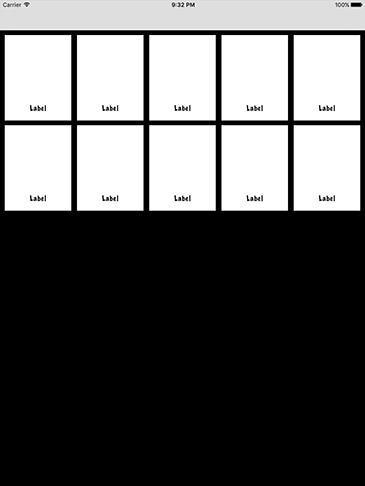

# UICollectionView data sources

We’ve now modified the user interface so that it considers `ViewController` to be a collection view controller, but we haven’t implemented any of the data source methods to make that work. This works just like table views, so we get questions like “how many items are there?” and “what’s in item number 1?” that we need to provide sensible answers for.

To begin with, let's put together the most basic implementation that allows our app to work. Add these two methods:

    override func collectionView(_ collectionView: UICollectionView, numberOfItemsInSection section: Int) -> Int {
        return 10
    }

    override func collectionView(_ collectionView: UICollectionView, cellForItemAt indexPath: IndexPath) -> UICollectionViewCell {
        let cell = collectionView.dequeueReusableCell(withReuseIdentifier: "Person", for: indexPath) as! PersonCell
        return cell
    }

We haven't looked at any of this code before, so I want to pull it apart in detail before continuing:

-   `collectionView(_:numberOfItemsInSection:)` This must return an integer, and tells the collection view how many items you want to show in its grid. I've returned 10 from this method, but soon we'll switch to using an array.
-   `collectionView(_:cellForItemAt:)` This must return an object of type `UICollectionViewCell`. We already designed a prototype in Interface Builder, and configured the `PersonCell` class for it, so we need to create and return one of these.
-   `dequeueReusableCell(withReuseIdentifier:for:)` This creates a collection view cell using the reuse identified we specified, in this case "Person" because that was what we typed into Interface Builder earlier. But just like table views, this method will automatically try to reuse collection view cells, so as soon as a cell scrolls out of view it can be recycled so that we don't have to keep creating new ones.

Note that we need to typecast our collection view cell as a `PersonCell` because we'll soon want to access its `imageView` and `name` outlets.

These two new methods both come from collection views, but I think you’ll find them both remarkably similar to the table view methods we’ve been using so far – you can go back and open project 1 again to see just how similar!

Press Cmd+R to run your project now, and you'll see the beginning of things start to come together: the prototype cell you designed in Interface Builder will appear 10 times, and you can scroll up and down to view them all. As you'll see, you can fit two cells across the screen, which is what makes the collection view different to the table view. Plus, if you rotate to landscape you'll see it automatically (and beautifully) animates the movement of cells so they take up the full width.

