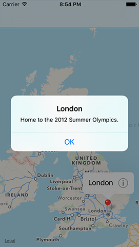

# Adding an extension: NSExtensionItem

Extensions are miniature apps in their own right, and as such need their own space in your code. That doesn't mean you can't share code and resources between your extensions and your app, just that it's not automatic.

To get started with a fresh extension, go to the File menu and choose New > Target. When you're asked to choose a template, select iOS > Application Extension > Action Extension, then click Next. For the name just call it Extension, make sure Action Type is set to "Presents User Interface", then click Finish.

When you create an extension inside an app, Xcode will ask you whether you want to activate its scheme. Check the "Do not show this message again" box then click Activate. With this change, when you run your code, you'll actually launch the extension – it's perfect for our needs right now.

Once your extension has been created, it will appear in the project navigation in its own yellow folder. You should see Project16 at the top, but look below and you'll see Extension. Open up the disclosure arrow and you'll see Xcode has given you two files: ActionViewController.swift and MainInterface.storyboard.

If you look inside ActionViewController.swift you'll see a fair amount of code, and I have some bad news for you: the code is complicated, the code is pretty much all new, and most of it is required. It's complicated because it needs to be: your extension doesn't talk to Safari and Safari doesn't talk to your extension, because it opens up security risks. Instead, iOS acts as an intermediary between Safari and the extension, passing data safely between the two.

To help make the code in `viewDidLoad()` a little easier to understand, I want you to delete it. Go on – zap it all, leaving `viewDidLoad()` doing nothing more than calling `super.viewDidLoad()`. We're going to replace it with code that is somewhat similar, but I've removed the complicated parts to try to make it easier. You'll probably want to return to Apple's template code in your own apps!

Change your `viewDidLoad()` method to this:

    override func viewDidLoad() {
        super.viewDidLoad()

        if let inputItem = extensionContext!.inputItems.first as? NSExtensionItem {
            if let itemProvider = inputItem.attachments?.first {
                itemProvider.loadItem(forTypeIdentifier: kUTTypePropertyList as String) { [unowned self] (dict, error) in
                    // do stuff!
                }
            }
        }
    }

Let's walk through that line by line:

- When our extension is created, its `extensionContext` lets us control how it interacts with the parent app. In the case of `inputItems` this will be an array of data the parent app is sending to our extension to use. We only care about this first item in this project, and even then it might not exist, so we conditionally typecast using `if let` and `as?`.
- Our input item contains an array of attachments, which are given to us wrapped up as an `NSItemProvider`. Our code pulls out the first attachment from the first input item.
- The next line uses `loadItem(forTypeIdentifier: )` to ask the item provider to actually provide us with its item, but you'll notice it uses a closure so this code executes asynchronously. That is, the method will carry on executing while the item provider is busy loading and sending us its data.
- Inside our closure we first need the usual `[unowned self]` to avoid strong reference cycles, but we also need to accept two parameters: the dictionary that was given to us to by the item provider, and any error that occurred.
- With the item successfully pulled out, we can get to the interesting stuff: working with the data. We have `// do stuff!` right now, but it'll be more interesting later, I promise.

This code takes a number of shortcuts that Apple's own code doesn't, which is why it's significantly shorter. Once you've gotten to grips with this basic extension, I do recommend you go back and look at Apple's template code to see how it loops through all the items and providers to find the first image it can.

Despite all that work, you can't see the results just yet – we need to do some configuration work first, because Apple's default action extension is configured for images, not for web page content.
