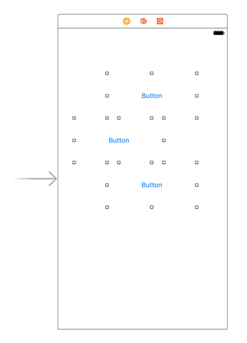
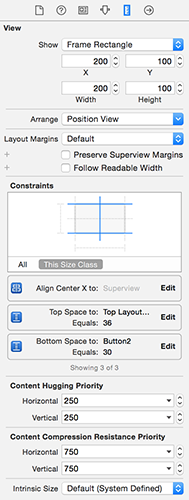
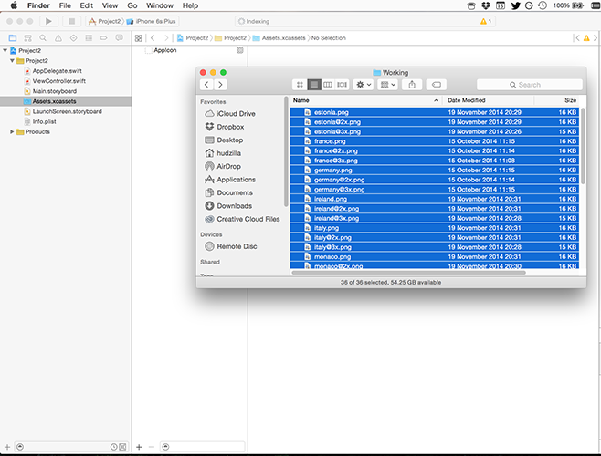
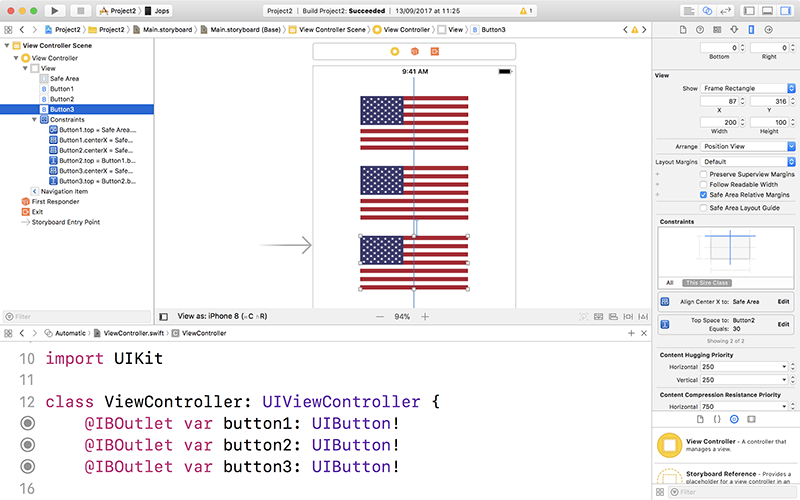

# Designing your layout

When working on my own projects, I find designing the user interface the easiest way to begin any project – it's fun, it's immediately clear whether your idea is feasible, and it also forces you to think about user journeys while you work. This project isn't complicated, but still Interface Builder is where we're going to begin.

Just as in project 1, the Single View App template gives you one `UIViewController`, called `ViewController`, and a storyboard called Main.storyboard that contains the layout for our single view controller. Choose that storyboard now to open Interface Builder, and you'll see a big, blank space ready for your genius to begin.

In our game, we're going to show users three flags, with the name of the country to guess shown in the navigation bar at the top. What navigation bar? Well, there isn't one, or at least not yet. We need to add one, just like we did with the previous project.

We covered a *lot* in project 1, so you’ve probably forgotten how to do this, but that’s OK: Single View App projects don't come with a navigation controller as standard, but it's trivial to add one: click inside the view controller, then go to the Editor menu and choose Embed In > Navigation Controller.

With the new navigation controller in place, scroll so you can see our empty view controller again, and draw out three `UIButton`s onto the canvas. This is a new view type, but as you might imagine it's just a button that users can tap. Each of them should be 200 wide by 100 high. You can set these values exactly by using the size inspector in the top-right of the Xcode window.

In the "old days" of iOS 6 and earlier, these `UIButtons` had a white background color and rounded edges so they were visibly tappable, but from iOS 7 onwards buttons have been completely flat with just some text. That's OK, though; we'll make them more interesting soon.

You can jump to the size inspector directly by pressing the keyboard shortcut Alt+Cmd+5 or by going to the View menu and choosing Utilities > Show Size Inspector. Don't worry about the X positions, but the Y positions should be 100 for the first flag, 230 for the second, and 360 for the third. This should make them more or less evenly spaced in the view controller.

In the picture below you can see the size inspector, which is the quickest and easiest way to position and size views if you know exactly where you want them.

The next step is to bring in Auto Layout so that we lay down our layout as rules that can be adapted based on whatever device the user has. The rules in this case aren't complicated, but I hope will begin to show you just how clever Auto Layout is.

We're going to create our Auto Layout rules differently from in Project 1. This is not because one way is better than another, instead just so that you can see the various possibilities and decide which one suits you best.

Select the top button, then Ctrl-drag from there directly upwards to just outside itself – i.e., onto the white area of the view controller. As you do this, the white area will turn blue to show that it's going to be used for Auto Layout.

When you let go of the mouse button, you'll be presented with a list of possible constraints to create. In that list are two we care about: “Top Space to Safe Area“ and "Center Horizontally in Safe Area.”

You have two options when creating multiple constraints like this: you can either select one then Ctrl-drag again and select the other, or you can hold down shift before selecting an item in the menu, and you'll be able to select more than one at a time. That is, Ctrl-drag from the button straight up to the white space in the view controller, let go of the mouse button and Ctrl so the menu appears, then hold down Shift and choose “Top Space to Safe Area“ and "Center Horizontally in Safe Area.” When that’s done, click Add Constraints to confirm that selection.

That's the first flag complete, so before we go any further let's bring it to life by adding some example content so you can see how it looks.

In Project 1, we added images to a project just by dragging a folder called Content into our Xcode project. That's perfectly fine and you're welcome to continue doing that for your other projects, but I want to introduce you to another option called *asset catalogs*. These are highly optimized ways of importing and using images in iOS projects, and are just as easy to use as a content folder.

In your Xcode project, select the file called Assets.xcassets. This isn't really a file, instead it's our default Xcode asset catalog. If you haven't already downloaded the files for this project, please do so now from GitHub (<https://github.com/twostraws/HackingWithSwift>).

Select all 36 flag pictures from the project files, and drag them into the Xcode window to beneath where it says "AppIcon" in our asset catalog. This will create 12 new entries in the asset catalog, one for each country.

As much as I hate diversions, this one is important: iOS assets come in the sizes 2x and 3x, which are two times and three times the size of the layout you created in Interface Builder. This might seem strange, but it’s a little bit of iOS magic that takes away a huge amount of work from developers.

Early iOS devices had non-retina screens. This meant a screen resolution of 320x480 pixels, and you could place things exactly where you wanted them – you asked for 10 pixels in from the left and 10 from the top, and that was what you got.

With iPhone 4, Apple introduced retina screens that had double the number of pixels as previous screens. Rather than make you design all your interfaces twice, Apple automatically switched sizes from pixels to “points” – virtual pixels. On non-retina devices, a width of 10 points became 10 pixels, but on retina devices it became 20 pixels. This meant that everything looked the same size and shape on both devices, with a single layout.

Of course, the whole point of retina screens was that the screen had more pixels, so everything looked sharper – just resizing everything to be larger wasn’t enough. So, Apple took things a step further: if you create hello.png that was 200x100 in size, you could also include a file called hello@2x.png that was 400x200 in size – exactly double – and iOS would load the correct one. So, you write hello.png in your code, but iOS knows to look for and load hello@2x.png on retina devices.

More recently, Apple introduced retina HD screens that have a 3x resolution. These follow the same naming convention: hello.png is for non-retina devices, hello@2x.png for retina devices, and hello@3x for retina HD devices. You still just write “hello.png” in your code and user interfaces, and iOS does the rest.

You might think this sounds awfully heavy – why should a non-retina device have to download apps that include @2x and @3x content that it can’t show? Fortunately, the App Store uses a technology called app thinning that automatically delivers only the content each device is capable of showing – it strips out the other assets when the app is being downloaded, so there’s no space wasted.

Cunningly, as of iOS 10 no non-retina devices are supported, so if you’re supporting only iOS 10 or later devices you only need to include the @2x and @3x images. I’ve included the 1x images for this project in case you want to use it on older iOS versions too.

Now, all this is important because when we imported the images into our asset catalog they were automatically placed into 1x, 2x and 3x buckets. This is because I had named the files correctly: france.png, france@2x.png, france@3x.png, and so on. Xcode recognized these names, and arranged all the images correctly.

Once the images are imported, you can go ahead and use them either in code or in Interface Builder, just as you would do if they were loose files inside a content folder. So, go back to your storyboard, choose the first button and select the attributes inspector (Alt+Cmd+4). You'll see it has the title "Button" right now (this is in a text field directly beneath where it says "Title: Plain"), so please delete that text. Now click the arrow next to the Image dropdown menu and choose "us".

As soon as you set a picture inside the button, our constraints for the button are complete: it has a Y position because we placed a constraint, it has an X position because we're centering it horizontally, and it has a width and a height because it's reading it from the image we assigned. Go ahead and assign the US flag to the other two buttons while you're there.

To complete our Auto Layout constraints, we need to assign Auto Layout constraints for the middle and bottom buttons. Select the middle button, then Ctrl-drag to the first button – not to the view controller. Let go, and you'll see "Vertical Spacing" and "Center Horizontally.” Choose both of these. Now choose the third button and Ctrl-drag to the second button, and again choose "Vertical Spacing" and "Center Horizontally."

At this point, our Auto Layout is almost complete, but you'll notice that even though we chose to center the flags horizontally, they all seem to be stuck where they were placed. The reason for this is that you need to tell Interface Builder to update all the frames of your buttons to match the Auto Layout rules you just created.

This is easy enough to do: select all three image views, then go to the Editor menu and choose Resolve Auto Layout Issues > Update Frames. Again, you’ll see that option appears twice in the menu, but both do the same thing here so you can select either. This command will update the frames – the positions and sizes – of each image view so that it matches the Auto Layout constraints we set.

The last step before we're finished with Interface Builder for now is to add some outlets for our three flag buttons, so that we can reference them in code. Activate the assistant editor by pressing Alt+Cmd+Return or by going to View > Assistant Editor > Show Assistant Editor. Now Ctrl-drag from the first flag to your code in order to create an outlet called `button1`, then from the second flag to create `button2`, and from the third flag to create `button3`.

We'll come back to it later on, but for now we're done with Interface Builder. Select ViewController.swift and go back to the standard editor (that is, press Cmd+return to turn off the assistant editor) so we can get busy with some coding.
