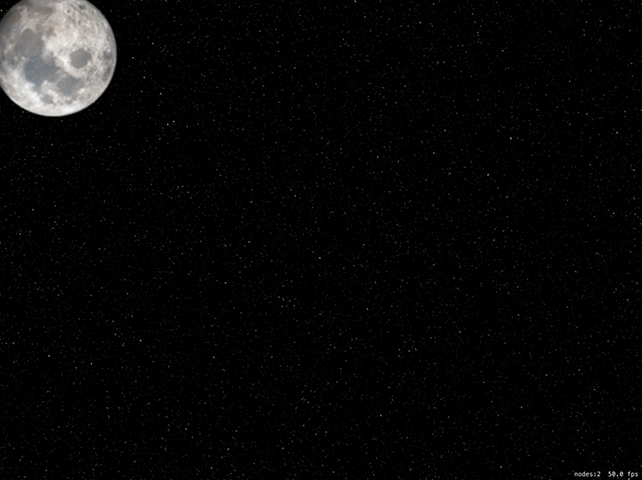
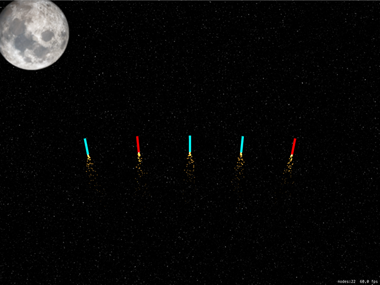

# Ready... aim... fire: Timer and follow()

To get the game up and running quickly, we're going to work on the three methods required to launch some fireworks: `didMove(to:)` will create a timer that launches fireworks every six seconds, `createFirework()` will create precisely one firework at a specific position and `launchFireworks()` will call `createFirework()` to create firework spreads.

First, the easy stuff: we need to add some properties to our class:

- The `gameTimer` property will be a new class called `Timer`. We'll use this to call the `launchFireworks()` method every six seconds.
- The `fireworks` property will be an array of `SKNode` objects. Fireworks, like the bomb fuse in project 17, will have a container node, an image node and a fuse node. This avoids accidental taps triggered by tapping on the fuse of a firework.
- The `leftEdge`, `bottomEdge`, and `rightEdge` properties are used to define where we launch fireworks from. Each of them will be just off screen to one side.
- The `score` property will track the player's score. I'm going to give you a `didSet` property observer but leave it blank for you to fill in later – you should know how to show a score label by now!

The only thing that's new in there is the `Timer` class, and we'll come to that in a moment. First, add these properties now:

    var gameTimer: Timer!
    var fireworks = [SKNode]()

    let leftEdge = -22
    let bottomEdge = -22
    let rightEdge = 1024 + 22

    var score = 0 {
        didSet {
            // your code here
        }
    }

To get the whole thing moving, we need to put in a background picture (the same way we've put in all the background pictures so far) and start up our `Timer` object. This is done using the `scheduledTimer(timeInterval:)` method, which not only creates the timer but also starts it going.

When you create an `Timer` you specify five parameters: how many seconds you want the delay to be, what object should be told when the timer fires, what method should be called on that object when the timer fires, any context you want to provide, and whether the time should repeat.

In our case, we're going to have it call `launchFireworks()` every six seconds, with repeating enabled. So, replace your current `didMove(to:)` with this:

    override func didMove(to view: SKView) {
        let background = SKSpriteNode(imageNamed: "background")
        background.position = CGPoint(x: 512, y: 384)
        background.blendMode = .replace
        background.zPosition = -1
        addChild(background)

        gameTimer = Timer.scheduledTimer(timeInterval: 6, target: self, selector: #selector(launchFireworks), userInfo: nil, repeats: true)
    }

That timer will carry on repeating until we tell it to stop, which in this project we won't – that'll be your job! Each time the timer fires, it will call `launchFireworks()`, which itself will call `createFirework()`. Initially we're going to write four types of firework "spreads" (different ways of launching fireworks) but this is something you could easily add more to later.

This system of having one method to create a single enemy and one to create multiple is identical to project 17, so hopefully it makes sense.

First, let's take a look at the `createFirework()` method. This needs to accept three parameters: the X movement speed of the firework, plus X and Y positions for creation. Inside the method there's a lot going on. It needs to:

1. Create an `SKNode` that will act as the firework container, and place it at the position that was specified.
2. Create a rocket sprite node, give it the name "firework" so we know that it's the important thing, adjust its `colorBlendFactor` property so that we can color it, then add it to the container node.
3. Give the firework sprite node one of three random colors: cyan, green or red. I've chosen cyan because pure blue isn't particularly visible on a starry sky background picture.
4. Create a `UIBezierPath` that will represent the movement of the firework.
5. Tell the container node to follow that path, turning itself as needed.
6. Create particles behind the rocket to make it look like the fireworks are lit.
7. Add the firework to our `fireworks` array and also to the scene.

Here's that, just in Swift:

    func createFirework(xMovement: CGFloat, x: Int, y: Int) {
        // 1
        let node = SKNode()
        node.position = CGPoint(x: x, y: y)

        // 2
        let firework = SKSpriteNode(imageNamed: "rocket")
        firework.colorBlendFactor = 1
        firework.name = "firework"
        node.addChild(firework)

        // 3
        switch Int.random(in: 0...2) { {
        case 0:
            firework.color = .cyan

        case 1:
            firework.color = .green

        case 2:
            firework.color = .red

        default:
            break
        }

        // 4
        let path = UIBezierPath()
        path.move(to: CGPoint(x: 0, y: 0))
        path.addLine(to: CGPoint(x: xMovement, y: 1000))

        // 5
        let move = SKAction.follow(path.cgPath, asOffset: true, orientToPath: true, speed: 200)
        node.run(move)

        // 6
        let emitter = SKEmitterNode(fileNamed: "fuse")!
        emitter.position = CGPoint(x: 0, y: -22)
        node.addChild(emitter)

        // 7
        fireworks.append(node)
        addChild(node)
    }

The coloring process is done using two new properties: `color` and `colorBlendFactor`. These two show off a simple but useful feature of SpriteKit, which is its ability to recolor your sprites dynamically with absolutely no performance cost. So, our rocket image is actually white, but by giving it `.red` with `colorBlendFactor` set to 1 (use the new color exclusively) it will appear red.

Step five is done using a new `SKAction` you haven't seen before: `follow()`. This takes a CGPath as its first parameter (we'll pull this from the `UIBezierPath`) and makes the node move along that path. It doesn't have to be a straight line like we're using, any bezier path is fine.

The `follow()` method takes three other parameters, all of which are useful. The first decides whether the path coordinates are absolute or are relative to the node's current position. If you specify `asOffset` as true, it means any coordinates in your path are adjusted to take into account the node's position.

The third parameter to `follow()` is `orientToPath` and makes a complicated task into an easy one. When it's set to true, the node will automatically rotate itself as it moves on the path so that it's always facing down the path. Perfect for fireworks, and indeed most things! Finally, you can specify a speed to adjust how fast it moves along the path.

Now comes the `launchFireworks()` method, which will launch fireworks five at a time in four different shapes. As a result this method is quite long because it needs to call `createFirework()` 20 times, but really it's not difficult at all.

The method will generate a random number between 0 and 3 inclusive. If it's zero, we launch the fireworks straight up; if it's one, we fire them in a fan from the center outwards; if it's two we fire them from the left edge to the right; it it's three we fire them from the right edge to the left.

Regardless of the direction of travel, the `createFirework()` call is much the same: how much should the firework move horizontally, and what should its starting X/Y coordinates be. Put this method into your project, then we'll look at it again:

    @objc func launchFireworks() {
        let movementAmount: CGFloat = 1800

        switch Int.random(in: 0...3) {
        case 0:
            // fire five, straight up
            createFirework(xMovement: 0, x: 512, y: bottomEdge)
            createFirework(xMovement: 0, x: 512 - 200, y: bottomEdge)
            createFirework(xMovement: 0, x: 512 - 100, y: bottomEdge)
            createFirework(xMovement: 0, x: 512 + 100, y: bottomEdge)
            createFirework(xMovement: 0, x: 512 + 200, y: bottomEdge)

        case 1:
            // fire five, in a fan
            createFirework(xMovement: 0, x: 512, y: bottomEdge)
            createFirework(xMovement: -200, x: 512 - 200, y: bottomEdge)
            createFirework(xMovement: -100, x: 512 - 100, y: bottomEdge)
            createFirework(xMovement: 100, x: 512 + 100, y: bottomEdge)
            createFirework(xMovement: 200, x: 512 + 200, y: bottomEdge)

        case 2:
            // fire five, from the left to the right
            createFirework(xMovement: movementAmount, x: leftEdge, y: bottomEdge + 400)
            createFirework(xMovement: movementAmount, x: leftEdge, y: bottomEdge + 300)
            createFirework(xMovement: movementAmount, x: leftEdge, y: bottomEdge + 200)
            createFirework(xMovement: movementAmount, x: leftEdge, y: bottomEdge + 100)
            createFirework(xMovement: movementAmount, x: leftEdge, y: bottomEdge)

        case 3:
            // fire five, from the right to the left
            createFirework(xMovement: -movementAmount, x: rightEdge, y: bottomEdge + 400)
            createFirework(xMovement: -movementAmount, x: rightEdge, y: bottomEdge + 300)
            createFirework(xMovement: -movementAmount, x: rightEdge, y: bottomEdge + 200)
            createFirework(xMovement: -movementAmount, x: rightEdge, y: bottomEdge + 100)
            createFirework(xMovement: -movementAmount, x: rightEdge, y: bottomEdge)

        default:
            break
        }
    }

You'll notice I made `movementAmount` into a constant. This is because I was testing various values to find one that worked best, so having it in a constant made it easy to adjust with trial and error.

As you can see in the code, each firework is fired from different positions so that you get a nice spread on the screen. For example, firing a fan creates one firework on the far left and moving to the left, one in the center left and moving to the left, one in the center moving straight up, and so on.

With that code, you're now able to run the game and see how it works – after a few seconds the first fireworks will start, then they'll continue launches as the timer continues to fire.

