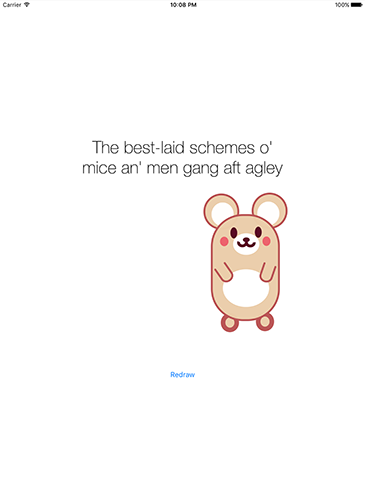

# Images and text

Add one final case to your switch/case statement calling a method `drawImagesAndText()`, because no discussion of Core Graphics would be useful without telling you how to draw images and text to your context.

If you have a string in Swift, how can you place it into a graphic? The answer is simpler than you think: all strings have a built-in method called `draw(with:)` that draws the string in a rectangle you specify. Even better, you get to customize the font and size, the formatting, the line wrapping and more all with that one method.

Remarkably, the same is true of `UIImage`: any image can be drawn straight to a context, and it will even take into account the coordinate reversal of Core Graphics.

Before you're able to draw a string to the screen, you need to meet two more classes: `UIFont` and `NSMutableParagraphStyle()`. The former defines a font name and size, e.g. Helvetica Neue size 26, and the latter is used to describe paragraph formatting options, such as line height, indents and alignment.

When you draw a string to the screen, you do using a dictionary of attributes that describes all the options you want to apply. We want to apply a custom font and custom paragraph style – that bit is easy enough. But the *keys* for the dictionary are special Apple constants: `NSAttributedString.Key.font` and `NSAttributedString.Key.paragraphStyle`.

To help make the code clearer, here's a bulleted list of all the things the method needs to do:

1. Create a renderer at the correct size.
2. Define a paragraph style that aligns text to the center.
3. Create an attributes dictionary containing that paragraph style, and also a font.
4. Draw a string to the screen using the attributes dictionary.
5. Load an image from the project and draw it to the context.
6. Update the image view with the finished result.

Below is that the same process, now coded in Swift. As per usual, the number comments match the list above:

    func drawImagesAndText() {
        // 1
        let renderer = UIGraphicsImageRenderer(size: CGSize(width: 512, height: 512))

        let img = renderer.image { ctx in
            // 2
            let paragraphStyle = NSMutableParagraphStyle()
            paragraphStyle.alignment = .center

            // 3
            let attrs = [NSAttributedString.Key.font: UIFont(name: "HelveticaNeue-Thin", size: 36)!, NSAttributedString.Key.paragraphStyle: paragraphStyle]

            // 4
            let string = "The best-laid schemes o'\nmice an' men gang aft agley"
            string.draw(with: CGRect(x: 32, y: 32, width: 448, height: 448), options: .usesLineFragmentOrigin, attributes: attrs, context: nil)

            // 5
            let mouse = UIImage(named: "mouse")
            mouse?.draw(at: CGPoint(x: 300, y: 150))
        }

        // 6
        imageView.image = img
    }

That completes our project. If you found Xcode's code completion wasn't filling in `draw(with:)` for you, try giving the string an explicit type of `NSString`, like this:

    let string: NSString = "The best-laid schemes o'\nmice an' men gang aft agley"      

The code works regardless, but having code completion around does help reduce mistakes!

