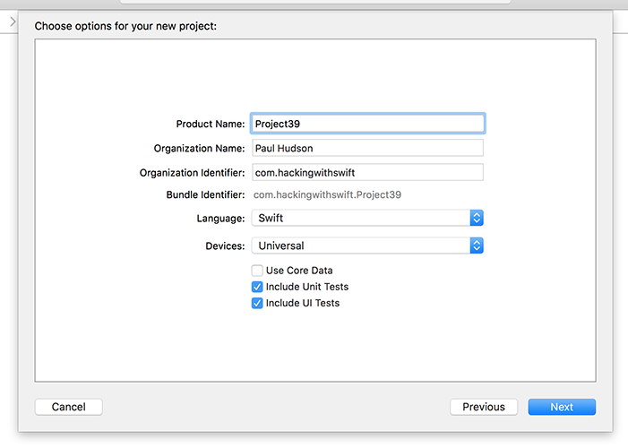
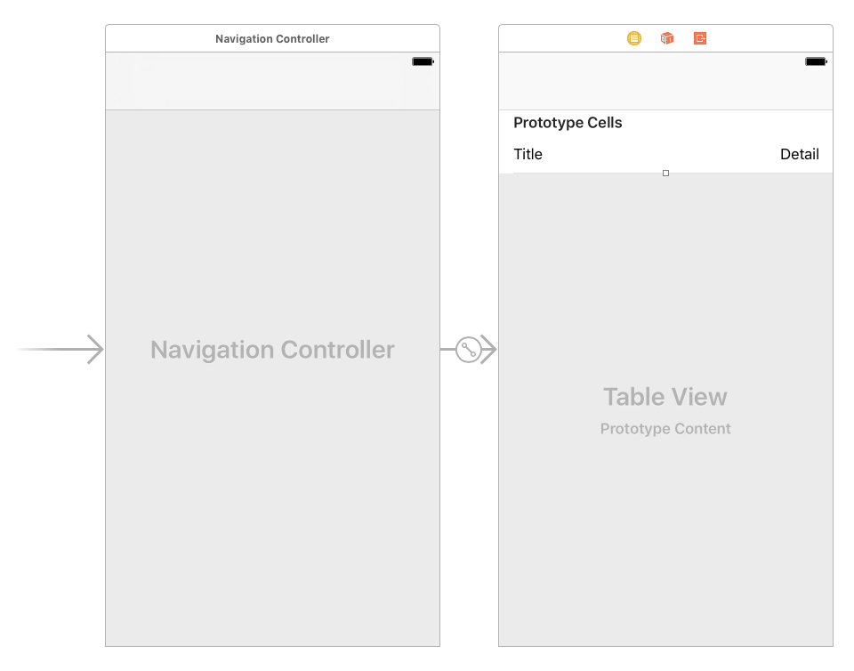

# Setting up

Although this is a technique project, it's a technique project with a difference because you're going to make an app from scratch. It's not a complicated app, don't worry: it will load a large file containing the text of all of Shakespeare's comedies, then have a table view showing how often each word is used.

Easy, right? Right. But here's why it's a technique project: while building this app you'll be learning all about XCTest, which is Xcode's testing framework. Although this isn't a tutorial on test-driven development, I will at least walk you through the concepts and apply them with you. Even better, I'll also be introducing you to some functional programming using `filter()`, so there's a lot to learn.

All set? Let's do this! Launch Xcode, then create a new Single View App named Project39. For the first time, please check both Include Unit Tests and Include UI Tests. Click Create, then save the project somewhere safe.

This project draws upon a text file containing the comedies of Shakespeare. The Hacking with Swift GitHub repository (<https://github.com/twostraws/HackingWithSwift>) contains all the resources for these projects, and you'll find **plays.txt** inside the `project39-files` folder. Please drag that into your Xcode project before continuing.

As usual, we started with a Single View App template but we want to have a table view controller instead, so we need to make a few changes:

1. Open ViewController.swift, then change `class ViewController: UIViewController {` to `class ViewController: UITableViewController {`
2. Open Main.storyboard and delete its view controller.
3. Look in the object library for a table view controller, then drag that out to where the previous view controller was.
4. Select the new table view controller, then change its class to be ViewController. This is done in the identity inspector (Alt+Cmd+3) by setting the Class field.
5. In the attributes inspector (Alt+Cmd+4) please check the box marked "Is Initial View Controller".
6. Go to the Editor menu and choose Embed In > Navigation Controller.
7. Select the prototype cell of your table view and change its style to be "Right Detail" and its reuse identifier to be "Cell".
8. If you want to, give your navigation bar a title, but this isn't required. Just double-click in the navigation bar space at the top of your table view controller and type some text.

At this point in your coding career, that should all come as second nature. You're welcome to try running the app now, but I'm afraid there isn't much to see yet – in fact, it should be almost blank!
