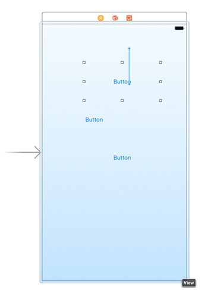
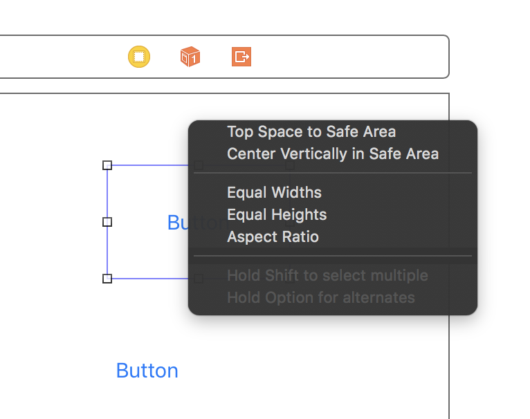
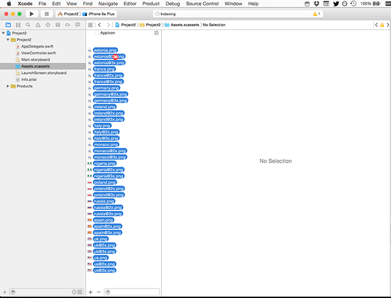
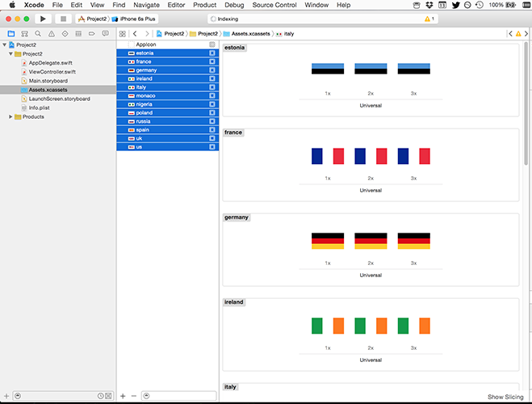

# Desenhar o Layout

<!-- YOUTUBE: qHPqGWzs17E -->

Para mim a forma mais fácil de começar a desenvolver os meus próprios projetos é desenhar a interface de utilizador - é divertido, torna rapidamente claro se a ideia é exequível e obriga-me a pensar acerca dos vários percursos que o utilizador poderá escolher. Mesmo este projeto não sendo complicado iremos começar pelo *Interface Builder*.

Tal como no projeto 1, o modelo, *template*, *Single View App* cria-nos um `UIViewController`, chamado `ViewController` e um *storyboard* chamado Main.storyboard que contém o *layout* para um *view controller* com uma única vista. Seleciona esse storyboard para abrires o *Interface Builder*, e irás ver um grande espaço em branco, *canvas*, onde podes começar a aplicar o teu talento criativo!

No nosso jogo, iremos mostrar ao utilizador três bandeiras, assim como o nome do país a adivinhar na barra de navegação, *navigation bar*, no topo. Qual barra de navegação? Bem, não temos nenhuma, pelo menos ainda. Temos de adicionar uma tal como fizemos no projeto anterior.

Cobrimos *muitos* tópicos no Projeto 1, por isso provavelmente já não te deves lembrar disto, o que é normal: os projetos *Single View App* não vêm por defeito com um *navigation controller*, mas adicioná-lo é bastante simples: clica dentro do *view controller*, depois vai ao menu *Editor* na barra superior e seleciona Embed In > Navigation Controller.

Após teres o *navigation controller*, faz *scroll* para conseguires ver novamente o *view controller* vazio, e usa a *object library* para adicionar três botões ao *canvas*. Este é um novo tipo de vista, mas como deves imaginar é apenas um botão em que os utilizadores podem clicar. Cada um deles deve ter 200 de largura e 100 de altura. Podes definir estes valores de forma exata usando o *size inspector* no topo superior direito da janela do *Xcode*.

Nos primórdios do iOS, os botões tinham como cor de fundo o branco, e cantos arredondados para que fossem visivelmente clicáveis. Hoje em dia, estes são completamente retos apenas com algum texto, mas iremos rapidamente torná-los mais interessantes.

Podes saltar diretamente para o *size inspector*  clicando no atalho de teclado Alt+Cmd+5 ou indo ao menu *View* e escolhendo Utilities > Show Size Inpector. Podes ignorar as posições X, mas as posições Y devem ser 100 para a primeira bandeira, 230 para a segunda e 360 para a terceira. Isto deverá espaçá-las mais ou menos uniformemente no *view controller*.

Na imagem abaixo, podes ver o *size inspector*, que constitui a forma mais fácil e rápida de posicionar e redimensionar as vistas se soubermos exatamente onde as queremos.

O próximo passo é integrar o *Auto Layout*, para podermos utilizar no nosso *layout* regras que possam ser adaptadas com base em qualquer dispositivo que o utilizador tenha. Neste caso estas regras não são muito complicadas, mas espero que dê para começar a perceber quão inteligente é o *Auto Layout*.

Iremos criar as nossas regras de *Auto Layout* de forma diferente do Projeto 1, não porque uma forma seja melhor do que a outra, mas para que conheças as várias possibilidades e possas decidir qual a que preferes utilizar.

Selecionar o primeiro botão, e clica em Ctrl-drag a partir deste diretamente para cima e para fora deste - isto é, para a área branca do *view controller*. Ao fazeres isto, a área branca irá tornar-se azul para mostrar que irá ser usada para o *Auto Layout*.

Quando largas o botão do rato, irás ser-te apresentada uma lista de *constraints*, restrições, para criares. Nessa lista há duas com que te deves preocupar “Top Space to Safe Area“ e "Center Horizontally in Safe Area.”

Ao criar criar múltiplas *constraints* desta forma, tens duas opções, podes: ou selecionar uma e depois fazer Ctrl-drag novamente e selecionar outra, ou pressionar a tecla shift antes de selecionar um item no menu, o que te permitirá selecionar mais do que um item em simultâneo. Isto é, Ctrl-drag do botão para o espaço em branco do *view controller*, largar o rato e Ctrl para que o menu apareça, depois pressionar Shift e escolher “Top Space to Safe Area“ e "Center Horizontally in Safe Area.” Quando terminares clica fora do menu para o fechar.

Terminámos a primeira bandeira! Assim antes de avançarmos vamos trazê-la à vida adicionando algum conteúdo de exemplo para que vejas como fica.

No Projeto 1, adicionámos imagens ao projeto arrastando-as a partir de uma pasta chamada *Content* para o nosso projeto de Xcode. Esta opção é perfeitamente correta e podes continuar a usá-la para os teus outros projetos, mas quero ensinar-te outra opção chamada *asset catalogs*. Este contém formas altamente otimizadas de importar e usar imagens em projetos iOS, e é tão fácil de usar como a pasta *Content*. 

No teu projeto Xcode, seleciona o ficheiro chamado Assets.xcassets. Este não é realmente um ficheiro, mas sim o nosso catálogo de *assets* por defeito do Xcode. Se ainda não tiveres descarregado os ficheiros para este projeto, podes fazê-lo agora a partir do GitHub (<https://github.com/twostraws/HackingWithSwift>).

Seleciona todas as 24 imagens de bandeiras dos ficheiros do projeto e arrasta-as para a janela do Xcode abaixo de onde diz "AppIcon" no teu catálogo de *assets*. Este procedimento irá criar 12 novas entradas no catálogo de *assets*, uma para cada país.

Por mais que odeie dispersar-me, esta nota é importante: os *assets* iOS vêm nos tamanhos 2x e 3x, que correspondem a duas vezes ou três vezes o tamanho do *layout* que criámos no *Interface Builder*. Isto pode parecer estranho, mas é uma pitada da magia do iOS que alivia uma grande parte do trabalho aos programadores.

Os dispositivos iOS mais antigos tinham ecrãs não-retina. Isto significava uma resolução de ecrã de 320x480 pixeis, e podias colocar as coisas exatamente onde querias que ficassem - se definisses 10 pixeis a partir da esquerda e 10 a partir do topo, isto seria o que obterias.

A partir do iPhone 4, a Apple introduziu os ecrãs retina que têm o dobro do número de pixeis que os ecrãs anteriores. Em vez de termos de desenhar todas as interfaces duas vezes, a Apple altera automaticamente as dimensões de pixeis para "points" - pixeis virtuais. Nos ecrãs não-retina, uma largura de 10 *points* torna-se 10 pixeis, mas nos dispositivos retina transforma-se em 20 pixeis. Isto permite que tudo seja apresentado do mesmo tamanho e forma em ambos os dispositivos apenas com um único *layout*.

Claro, que o objetivo dos ecrãs retina terem mais pixeis é tudo fique mais definido - apenas redimensionar tudo para um tamanho maior não é suficiente. Então, a Apple levou as coisas ainda mais longe: se criares um hello.png, com um tamanho de 200x100, podes também incluir um ficheiro hello@2x.png com dimensões 400x200 - exatamente o dobro - e o iOS irá carregar a imagem correta. Assim, sempre que escreveres hello.png no teu código, o iOS saberá procurar a imagem correta e carregar hello@2x.png nos dispositivos retina.

Mais tarde, foram introduzidos os ecrãs retina HD que têm uma resolução 3x, e estes seguiram a mesma nomenclatura: hello@2x.png é para dispositivos retina e hello@3x para dispositivos retina HD. Da mesma forma, apenas tens de escrever "hello" no teu código ou na interface de utilizador, e o iOS trata do resto.

Poderás estar pensar que isto parece ser um procedimento extremamente pesado - porque é que um dispositivo retina tem de descarregar aplicações que incluem o conteúdo Retina HD que não irá mostrar? Felizmente a App Store usa uma tecnologia chamada *app thinning* que distribui automaticamente apenas o conteúdo que cada dispositivo é capaz de apresentar - retirando os *assets* em excesso quando a aplicação está a ser descarregada, para que não seja desperdiçado espaço.

Para além disto, a partir do iOS 10 já não são suportados dispositivos não-retina, logo, se só estás a abranger apenas dispositivos com iOS 10 ou subsequentes apenas tens de incluir imagens @2x e @3x.

Tudo isto é importante porque uma vez importadas as imagens para o catálogo de *assets* elas foram automaticamente colocados nas secções 2x e 3x. Isto deve-se a forma como os ficheiros estão nomeados: france@2x.png, france@3x.png, e por aí fora. O Xcode reconhece estes nomes e organiza as imagens corretamente.

Após importadas as imagens, podes usá-las quer quer no código quer no *Interface Builder*, tal como farias com ficheiros soltos dentro da pasta *Content*. Assim, volta ao storyboard, seleciona o primeiro botão e seleciona o *attributes inpector* (Alt+Cmd+4). Verás que ainda tem o título "Button" (está numa campo de texto diretamente abaixo de onde diz "Title: Plain"), apaga este texto. Agora clica na seta ao lado do *Image dropdown* menu e escolhe "us".

Assim que definirmos uma imagem dentro do botão, as nossas *constraints* para o botão estão completas: tem uma posição Y porque a definimos, tem uma posição X porque o centrámos horizontalmente, e tem uma largura e uma altura porque as está a ler da imagem que lhe assignámos. Agora, adiciona a bandeira dos US ao outros botões.

Para completar as *constraints* de *Auto Layout*, precisamos de assignar *constraints* de *Auto Layout* ao segundo e terceiro botões. Seleciona o botão do meio, faz Ctrl-drag para o primeiro botão - e não para o *view controller*. Larga, e irás ver "Vertical Spacing" e "Center Horizontaly". Seleciona ambos. Agora seleciona o terceiro botão e faz Ctrl-drag para o segundo botão, e seleciona novamente "Vertical Spacing" e "Center Horizontally."

Neste momento, o nosso *Auto Layout* está quase completo, mas irás reparar que apesar de termos escolhido centrar as bandeiras horizontalmente, elas parecem estar presas ao mesmo sítio onde foram colocadas. Isto deve-se ao facto de necessitarmos de dizer ao *Interface Builder* para atualizar as *frames* dos botões para respeitar as regras de *Auto Layout* que acabámos de criar.

Isto é relativamente fácil de fazer: seleciona as três imagens, depois vai ao menu *Editor* e escolhe Resolve Auto Layout Issues > Update Frames. Mais uma vez, verás que esta opção aparece duas vezes no menu, ambas fazem a mesma coisa por isso podes selecionar qualquer uma delas. Este comando irá atualizar as *frames* - as posições e dimensões - de cada imagem de forma a corresponderem às *constraints* de *Auto Layout* definidas.

O último passo antes de terminamos, por agora, com o *Interface Builder*, é adicionar alguns *outlets* para os três botões-bandeira, de forma a que os possamos referenciar em código. Ativa o *assistant editor* clicando em Alt-Cmd-Return ou indo a View > Assistant Editor > Show Assistant Editor. Agora faz Ctrl-drag da primeira bandeira para o teu código de forma a criar um *outlet* chamado `button1`, e depois a partir segunda bandeira para criar `button2`, e da terceira para criar `button3`. 

Iremos voltar aqui mais tarde, mas por agora terminámos com o *Interface Builder*. Seleciona o ViewController.swift e volta ao *standard editor* (ou seja, pressiona Cmd+Return para desativar o *assistant editor*) para que possamos agora debruçar-nos sobre o código.
