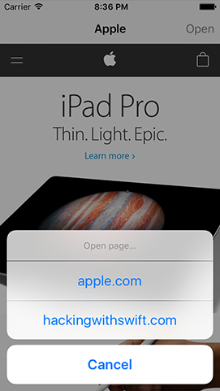

# Escolher uma página web: UIAlertController action sheets

<!-- YOUTUBE: LkqYPTSk3aQ -->

Iremos bloquear a nossa aplicação de forma a que apenas seja possível carregar páginas *web* selecionadas pelo utilizador. O primeiro passo é dar ao utilizador a opção de escolher uma de entre várias páginas web selecionadas por nós, o que significa que iremos adicionar um botão à *navigation bar*.

Algures no `viewDidLoad()` (mas sempre após a chamada a `super.viewDidLoad()`), adiciona esta linha:

    navigationItem.rightBarButtonItem = UIBarButtonItem(title: "Open", style: .plain, target: self, action: #selector(openTapped))

Fizemos exatamente o mesmo no projeto anterior, exceto a parte em que usamos um título personalizado para o nosso botão em vez de um ícone de sistema. O botão irá chamar o método `openTapped()` quando clicado, por isso vamos adicioná-lo. Coloca este método abaixo do `viewDidLoad()`:

    @objc func openTapped() {
        let ac = UIAlertController(title: "Open page…", message: nil, preferredStyle: .actionSheet)
        ac.addAction(UIAlertAction(title: "apple.com", style: .default, handler: openPage))
        ac.addAction(UIAlertAction(title: "hackingwithswift.com", style: .default, handler: openPage))
        ac.addAction(UIAlertAction(title: "Cancel", style: .cancel))
        ac.popoverPresentationController?.barButtonItem = self.navigationItem.rightBarButtonItem
        present(ac, animated: true)
    }

Ainda não escrevemos o método `openPage()`, por isso podemos ignorar os alertas por agora. Tal como no projeto 3 estamos a chamar o método `openTapped()` a partir do código Objective-C nativo da Apple do `UIBarButtonItem`, por isso este método tem de ser anotado com `@objc`.

No projeto 2 também usámos um `UIAlertController`, mas agora é um pouco diferente por três razões:

1. Estamos a usar `nil`para a mensagem, uma vez que o alerta não necessita de uma.
2. Selecionámos como `preferredStyle`  `.actionSheet` uma vez que vamos pedir ao utilizador mais informações.
3. Adicionámos um botão Cancelar - *Cancel* - utilizando o estilo `.cancel`. Este não disponibiliza um parâmetro `handler`, o que significa que o iOS irá fechar o nosso *alert controller* quando este for clicado.

Ambos os nossos botões apontam para o mesmo método `openPage()`, que também ainda não existe. Este método irá ser muito semelhante àquele com que carregámos a página *web* anteriormente, mas desta vez iremos ver porque é que o método *handler* do `UIAlertAction` recebe um parâmetro a dizer que ação foi selecionada!

Adiciona este método imediatamente abaixo do método `openTapped()` que acabámos de criar: 

    func openPage(action: UIAlertAction) {
        let url = URL(string: "https://" + action.title!)!
        webView.load(URLRequest(url: url))
    }

Este método recebe um parâmetro, que é o objeto `UIAlertAction` que foi selecionado pelo utilizador. Obviamente que não será chamado se o utilizador clicar em *Cancel*, uma vez que que este tem um *handler* `nil`em vez de `openPage`.

O que este método faz é pegar na propriedade título da ação (apple.com, hackingwithswift.com), colocar "https://" no início da mesma para satisfazer a *App Transport Security*, e construir o `URL` a partir desta. Depois insere-o num `URLRequest`, e passa-o à *web view* para ser carregado. Tudo o que precisas de fazer é garantir que as páginas *web* no `UIAlertController` estão corretas, e que este método irá carregar algo.

Agora podes testar a aplicação, mas há uma pequena alteração que teremos de fazer para que a experiência se torne agradável: definir o título da *navigation bar*. Nós somos o *navigation delegate*, o que significa que iremos ser informados quando algo de interessante acontecer em termos de navegação, como por exemplo uma página ter terminado de ser carregada, e iremos usar isto para definir o título na *navigation bar*.

Logo que informámos o Swift que a nossa classe `ViewController` estava conforme o protocolo `WKNavigationDelegate`, o Xcode atualizou o sistema de auto-sugestão de código para suportar todos os métodos `WKNavigationDelegate`  que pudessem ser chamados. Como consequência, se abaixo do método `openPage()`começares a tentar digitar "web" irás ver uma lista de todos os métodos que o `WKNavigationDelegate` pode usar.

Faz *scroll* na lista de opções até veres o método `didFinish` e pressiona *enter* para que o Xcode preencha o método por ti. Agora modifica-o da seguinte forma:

    func webView(_ webView: WKWebView, didFinish navigation: WKNavigation!) {
        title = webView.title
    }

Tudo o que este método faz é atualizar a propriedade `title` do *view controller* para ser o título da *web view*, que será automaticamente definido como o título da página web que foi mais recentemente carregada.

Pressiona Cmd+R para correr a aplicação e irás ver as coisas começarem a ganhar forma: a tua página web inicial irá ser carregada e quando o carregamento terminar irás ver o seu título na *navigation bar*.

